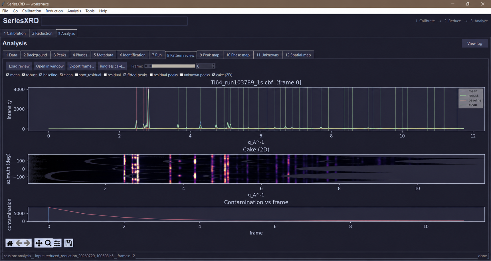

# SeriesXRD

GUI-driven workflow for powder X-ray diffraction: detector calibration review,
dataset reduction, and pattern analysis. Facility-neutral by design — it works
the same way for a synchrotron beamline or a lab (in-house) diffractometer,
any calibrant, any detector pyFAI supports, and any beamline-specific frame
naming or metadata convention (see "Site adoption" in
[`docs/roadmap.md`](docs/roadmap.md) for exactly what a new site needs to
supply). A single unified desktop application (`seriesxrd`) hosts all pipeline
stages in one window. Heavy pyFAI work still runs in crash-isolated
`worker.py` subprocesses so a pyFAI or matplotlib crash never takes down the
GUI.



*Pattern review in the unified SeriesXRD application, using the included
Ti-6Al-4V demonstration workflow.*

## Pipeline

The workflow is one subpackage per stage, communicating only through artifacts
on disk plus a shared workspace folder:

1. **`seriesxrd.calib`** — calibration review: standard image →
   accepted `.poni` + mask + QA record, ending in a
   `calibration_handoff.json` (internal artifact passed automatically to
   the Reduction tab — not a user-facing step).
2. **`seriesxrd.reduce`** — dataset reduction: apply the accepted
   geometry/mask to a sample dataset, parallel batch azimuthal integration →
   1D patterns (mean, azimuthal-quantile-band "robust", and optional
   sigma-clipped trimmed mean) and optional 2D cakes in one HDF5 file + JSON
   manifest. Frame sources include plain images and HDF5/NeXus stack
   containers (Eiger-style master files), with per-frame metadata (timestamp,
   stage position, temperature) harvested automatically. `seriesxrd-watch`
   adds a live mode that reduces and periodically re-analyzes a dataset
   folder while frames are still being collected.
3. **`seriesxrd.analysis`** — pattern analysis: SNIP background + diamond-spot
   separation (Step 1), pseudo-Voigt peak fitting (Step 2), pressure-aware
   EOS phase identification + residual removal (Step 3a), the ML
   candidate-ranking seam (Step 3b: deterministic cosine ranker by default,
   optional learned scorer — see `docs/ml-training.md`), and unknown-phase
   clustering of the leftover residual (Step 3c). Semi-quantitative phase
   fractions, azimuthal texture metrics, and a Rietveld hand-off export round
   out the tooling.

The calib→reduce handoff JSON is an internal artifact written to the workspace
and automatically loaded by the Reduction tab — users do not need to manage it
manually.

## Repository layout

```
├── seriesxrd/             The installable package
│   ├── core/            Shared by all stages (stdlib/numpy only)
│   │   ├── config.py        SessionConfig, JSON/hash/file helpers
│   │   ├── env.py           dependency / conda environment checks
│   │   ├── naming.py        output folder/file naming conventions
│   │   ├── io.py            detector image readers (fabio/tifffile/PIL) and
│   │   │                    HDF5/NeXus frame-stack ingestion (Eiger master files)
│   │   ├── masks.py         automatic + polygon detector masks
│   │   ├── handoff.py       the calib→reduce handoff contract (load/validate)
│   │   └── inspect.py       detector-image diagnostic CLI (seriesxrd-inspect)
│   ├── guikit/          Shared GUI/plot theming
│   │   ├── theme.py         dark Catppuccin palette (Tk + matplotlib)
│   │   ├── tkstyle.py       shared ttk style (apply_dark_theme)
│   │   └── dpi.py           HiDPI / Windows DPI-awareness helpers
│   ├── calib/           Calibration review stage
│   │   ├── processing.py    pyFAI integration + QA figure generation
│   │   ├── worker.py        crash-isolated worker subprocess
│   │   ├── gui.py           tabbed Tkinter GUI (embeddable pane)
│   │   ├── dioptas.py       optional Dioptas hand-off
│   │   └── run_gui.py       CLI entry point (seriesxrd-calib-gui)
│   ├── reduce/          Batch reduction stage
│   │   ├── processing.py    batch azimuthal integration logic
│   │   ├── worker.py        crash-isolated worker subprocess
│   │   ├── session.py       workspace config seeding (seed_reduction_config)
│   │   ├── review.py        read-only HDF5 checkpoint review
│   │   ├── straighten.py    cake-waviness diagnosis + straightened-1D rescue channel
│   │   ├── texture.py       azimuthal texture metrics per saved cake (seriesxrd-texture)
│   │   ├── watch.py         live (during-beamtime) reduction + rolling analysis (seriesxrd-watch)
│   │   ├── gui.py           tabbed Tkinter GUI (embeddable pane)
│   │   └── run_gui.py       CLI entry point (seriesxrd-reduce-gui)
│   ├── app.py           unified application (seriesxrd entry point)
│   └── analysis/        analysis stage (background, peaks, identification,
│                        maps, ML ranking/training, and exports)
├── tests/               automated pytest suite
├── examples/            calibration_session_config.example.json (schema reference),
│                        fetch_benchmark_example.sh (downloads a real-data
│                        seriesxrd-benchmark example set — see docs/ml-training.md)
├── environment.yml      conda environment (recommended install route)
└── pyproject.toml       package metadata + pip dependencies
```

Stage convention: pure logic modules + a crash-isolated `worker.py` + an
embeddable `gui.py` pane. Logic stays importable and headless so stages can
also run as batch jobs without any GUI.

## Installation

Recommended for a source checkout (pyFAI installs most reliably from conda-forge):

```bash
conda env create -f environment.yml
conda activate seriesxrd
```

After publication, install the core package from PyPI:

```bash
python -m pip install seriesxrd
python -m pip install "seriesxrd[io,stacks,phases]"  # optional readers and crystallography
```

For development from a source checkout:

```bash
python -m pip install -e ".[dev]"
```

`tkinter` must be available in your Python (it ships with python.org and
conda-forge Python; some Linux distros need `python3-tk`).

## Usage

### Unified application (primary)

```bash
seriesxrd --workspace <dir>
# Windows/macOS GUI entry point (no console window):
seriesxrd-gui --workspace <dir>
# or without installing:
python -m seriesxrd.app --workspace <dir>
```

Opens one window with **1 Calibration**, **2 Reduction**, and **3 Analysis**
tabs. Accepting a calibration hands its PONI + mask to the Reduction tab
automatically; a finished reduction hands its output HDF5 to the Analysis
tab automatically — the handoffs are automatic in both directions, not a
manual file-picking step. The workspace folder holds the stage configs and
all outputs. On first launch the configs are auto-created with sensible
defaults.

The GUI embeds all three stage panes in one process; heavy pyFAI work still
runs in `worker.py` subprocesses (one per stage) so a worker crash never
affects the host window or another stage.

### End-to-end demonstration data

The [Ti-6Al-4V demo](examples/ti64_demo/README.md) downloads a compact,
checksum-pinned set of real synchrotron detector frames and guides it through
the unified GUI. The third-party CBF data remain in a gitignored local
workspace and are not bundled with SeriesXRD.

### Per-stage standalone GUIs

Each stage also has a standalone entry point for advanced use:

```bash
seriesxrd-calib-gui    --config <path/to/calibration_session_config.json>
seriesxrd-reduce-gui   --config <path/to/reduction_session_config.json>
seriesxrd-analysis-gui --config <path/to/analysis_session_config.json>   # optional; auto-found if omitted
```

### Detector-image diagnostic

```bash
seriesxrd-inspect <image_file>
# or:
python -m seriesxrd.core.inspect <image_file>
```

### Headless analysis + ML training

```bash
seriesxrd-analyze reduced.h5 --phases Au,Re          # Steps 1-3a, no GUI
seriesxrd-analyze reduced.h5 --ml-rank               # candidate-free: rank whole library
seriesxrd-ml-train --workspace <dir> --out scorer.pt # train the learned scorer
```

Training the Step-3b learned scorer (data collection, environment setup,
corpus building, validation gates, deployment) is documented in
[`docs/ml-training.md`](docs/ml-training.md).

### All console scripts

| Command | Purpose |
|---|---|
| `seriesxrd` | Unified GUI: Calibration + Reduction + Analysis tabs in one window. |
| `seriesxrd-gui` | Unified GUI without a console window on supported desktop platforms. |
| `seriesxrd-calib-gui` | Calibration stage standalone GUI. |
| `seriesxrd-reduce-gui` | Reduction stage standalone GUI (includes live watch-mode controls). |
| `seriesxrd-analysis-gui` | Analysis stage standalone GUI. |
| `seriesxrd-analyze` | Headless analysis CLI (Steps 1-3, ML ranking, exports). |
| `seriesxrd-watch` | Live reduction + rolling analysis while frames are still being collected. |
| `seriesxrd-ml-train` | Train the Step-3b learned candidate scorer. |
| `seriesxrd-benchmark` | Score a scorer against labelled XY patterns (RRUFF/opXRD-style known-truth harness). |
| `seriesxrd-corpus` | Fetch/screen a training-only CIF corpus for `seriesxrd-ml-train --cif-dir`. |
| `seriesxrd-texture` | Azimuthal texture metrics (`/texture`) from a cakes-enabled reduction. |
| `seriesxrd-export-refinement` | Rietveld hand-off bundle (`.xy` patterns + phase CIFs + GSAS-II instprm) from an analysis HDF5. |
| `seriesxrd-export-gsas` | GSAS-ready raw patterns grouped by pressure. |
| `seriesxrd-stack` | Publication-style stacked or waterfall pattern plots. |
| `seriesxrd-inspect` | Detector-image diagnostic: true format from magic bytes, per-reader interpretation, intensity statistics, and a verdict. |

See [`docs/workflow.md`](docs/workflow.md) for how each of these fits into
the end-to-end pipeline and [`docs/ml-training.md`](docs/ml-training.md) for
the ML-specific ones.

## Tests

Install the development dependencies and run the test suite with pytest:

```bash
python -m pip install -e .[dev]
python -m pytest
```

## Documentation

- [`docs/workflow.md`](docs/workflow.md) — end-to-end analysis workflow.
- [`docs/ml-training.md`](docs/ml-training.md) — training, validating, and
  deploying the Step-3b learned scorer (cluster-agnostic — works on any
  cluster or workstation).
- [`docs/roadmap.md`](docs/roadmap.md) — implemented vs. planned features,
  and what a new facility needs to provide to adopt seriesxrd.
- [`docs/test-data.md`](docs/test-data.md) — open datasets you can download to
  exercise each stage (calibration frames, measured patterns, CIFs, simulated
  patterns) and which command each one feeds.
- [`examples/ti64_demo/README.md`](examples/ti64_demo/README.md) — prepared,
  end-to-end Ti-6Al-4V calibration and exposure-series demonstration.
- [`docs/releasing.md`](docs/releasing.md) — build, TestPyPI, and release
  verification checklist.

## Citation

Citation metadata is provided in [`CITATION.cff`](CITATION.cff). GitHub can
use this file to generate a formatted software citation.

Project roles and acknowledgments are listed in [`CREDITS.md`](CREDITS.md).

Feature status and planned work are maintained in
[`docs/roadmap.md`](docs/roadmap.md).

## Contributing and support

See [`CONTRIBUTING.md`](CONTRIBUTING.md) to set up a development environment
and submit changes. Report defects through the GitHub issue tracker; report
security concerns according to [`SECURITY.md`](SECURITY.md). Community
participation is governed by [`CODE_OF_CONDUCT.md`](CODE_OF_CONDUCT.md).
