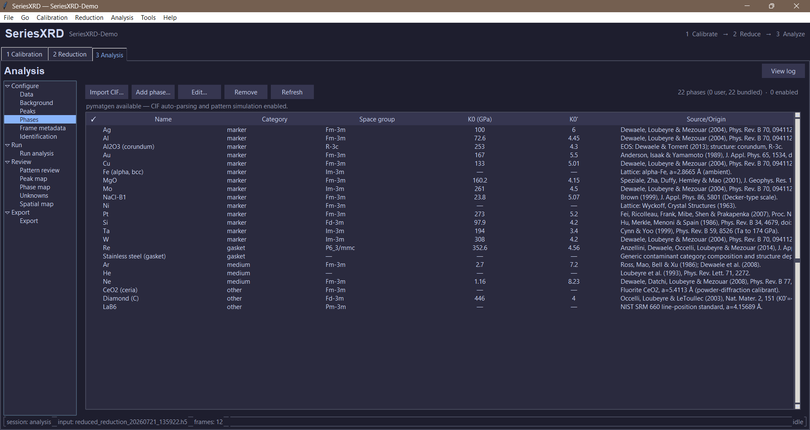

# Bundled phase library: sources and provenance

Where every number in the bundled reference-phase baseline
(`seriesxrd/analysis/refdata/baseline_phases.json`) comes from. All
equations of state are **room-temperature (300 K) isotherms**; the EOS form
is third-order Birch–Murnaghan (BM3) unless noted. Lattice parameters are
ambient-condition values used to simulate peak positions and relative
intensities; `p_max` marks a stability ceiling beyond which the entry is
never fitted or simulated.

*The bundled reference library in Analysis → Configure → Phases. Entries can
be reviewed, enabled, edited, removed, or supplemented with imported CIFs.*

> **Semi-quantitative by design.** These entries exist so phases can be
> *identified* across a pressure series. If you need pressures at
> marker-scale accuracy, choose your own preferred pressure scale for the
> marker and verify the parameters below against the primary literature —
> several widely-used scales disagree at the few-percent level (see the
> correction history below the table).

## Pressure markers

| Phase | Structure (ambient a, Å) | EOS values (V0 ų, K0 GPa, K0′) | Experimental range of the source | Source |
|---|---|---|---|---|
| Au | fcc, 4.0782 | 67.847, 167.0, 5.5 | thermodynamic analysis (not a single compression run) | Anderson, Isaak & Yamamoto (1989) [1] |
| Pt | fcc, 3.9231 | **Vinet**: 60.383, 273.0, 5.20 | internally consistent P–V–T scale (static + shock constraints) | Fei et al. (2007) [12] |
| Cu | fcc, 3.6149 | 47.241, 133.0, 5.01 | quasi-hydrostatic DAC to ~94 GPa | Dewaele, Loubeyre & Mezouar (2004) [3] |
| Ag | fcc, 4.0857 | 68.204, 100.0, 6.0 | quasi-hydrostatic DAC to ~94 GPa | [3] |
| W | bcc, 3.1652 | 31.708, 308.0, 4.2 | quasi-hydrostatic DAC to ~94 GPa | [3] |
| Mo | bcc, 3.1470 | 31.166, 261.0, 4.5 | quasi-hydrostatic DAC to ~94 GPa | [3] |
| Al | fcc, 4.0495 | 66.41, 72.6, 4.45 | quasi-hydrostatic DAC (Al to ~153 GPa) | [3] |
| Ta | bcc, 3.3013 | 35.98, 194.0, 3.4 | DAC to 174 GPa | Cynn & Yoo (1999) [4] |
| MgO | B1, 4.2117 | 74.706, 160.2, 4.15 | quasi-hydrostatic DAC to 52 GPa | Speziale et al. (2001) [5] |
| NaCl (B1) | B1, 5.6402 | 179.43, 23.8, 5.07; `p_max` 30 GPa (B1→B2) | P–V–T reanalysis to ~25 GPa | Brown (1999) [6] |
| Si | diamond cubic, 5.43102 | 160.2, 97.9, 4.2; `p_max` 11 GPa (→β-Sn) | DAC to ~50 GPa (cubic branch below 11 GPa) | Hu, Merkle, Menoni & Spain (1986) [7] |
| Ni | fcc, 3.5240 | structure only (no EOS bundled) | — | Wyckoff, *Crystal Structures* (1963) [8] |
| Fe (α, bcc) | bcc, 2.8665 | structure only; α→ε near 13 GPa | — | standard ambient lattice [8] |

**Correction history.** Earlier revisions carried Au K0′ = 5.0 (vs the
cited source's ≈ 5.5), a Pt pair (277 GPa / 5.08, BM3) matching neither
its cited source nor any single named scale, and Re parameters rounded
from the source fit. These were pinned to named scales in the
pre-release audit: Au now uses Anderson et al. [1] as recommended
(167 GPa / 5.5), Pt is re-cited to the Fei et al. [12] Vinet scale
(273 GPa / 5.20), and Re carries Anzellini et al. [9]'s Vinet fit
unrounded (352.6 GPa / 4.56). Alternative scales (Holmes et al. [2],
Dorogokupets & Dewaele [13]) remain in the bibliography; users needing a
different scale for cross-study consistency can override any entry from
the Phases tab.

## Gaskets, media, anvil, calibrants

| Phase | Structure (ambient a, c Å) | EOS values | Notes | Source |
|---|---|---|---|---|
| Re (gasket) | hcp, 2.7609 / 4.4576 | **Vinet**: 29.43, 352.6, 4.56 | DAC to 144 GPa (He medium) | Anzellini et al. (2014) [9] |
| Stainless steel (gasket) | — | none | generic contaminant category; grade-dependent | — |
| Ne (medium) | fcc, 4.464 | **Vinet**: 88.967, 1.16, 8.23 | DAC to 209 GPa; V0/K0 are zero-pressure extrapolations of the solid | Dewaele et al. (2008) [10] |
| Ar (medium) | fcc, 5.30 | 148.88, 2.7, 7.2 (zero-pressure extrapolation) | shock + static comparison | Ross, Mao, Bell & Xu (1986) [11]; see also [10] |
| He (medium) | — | none bundled (solidifies ~11.5 GPa) | enter parameters from the source if needed | Loubeyre et al. (1993) [14] |
| Diamond (anvil) | Fd-3m, 3.56712 | 45.38, 446.0, 4.0 (K0′ fixed at 4) | single-crystal DAC to 140 GPa | Occelli, Loubeyre & LeToullec (2003) [15] |
| Al₂O₃ (corundum) | R-3c, 4.7592 / 12.9918 | 254.9, 253.0, 4.3 | DAC to 165 GPa; trigonal — isotropic scaling is approximate | Dewaele & Torrent (2013) [16] |
| CeO₂ (ceria) | fluorite, 5.4113 | structure only (geometry calibrant) | used at ambient | powder-diffraction calibrant convention |
| LaB₆ | Pm-3m, 4.15689 | structure only (line-position standard) | used at ambient | NIST SRM 660 [17] |

## Bibliography

1. O. L. Anderson, D. G. Isaak, S. Yamamoto, "Anharmonicity and the
   equation of state for gold," *J. Appl. Phys.* **65**, 1534 (1989).
   [doi:10.1063/1.342969](https://doi.org/10.1063/1.342969)
2. N. C. Holmes, J. A. Moriarty, G. R. Gathers, W. J. Nellis, "The equation
   of state of platinum to 660 GPa (6.6 Mbar)," *J. Appl. Phys.* **66**,
   2962 (1989). [doi:10.1063/1.344177](https://doi.org/10.1063/1.344177)
3. A. Dewaele, P. Loubeyre, M. Mezouar, "Equations of state of six metals
   above 94 GPa," *Phys. Rev. B* **70**, 094112 (2004).
   [doi:10.1103/PhysRevB.70.094112](https://doi.org/10.1103/PhysRevB.70.094112)
4. H. Cynn, C.-S. Yoo, "Equation of state of tantalum to 174 GPa,"
   *Phys. Rev. B* **59**, 8526 (1999).
   [doi:10.1103/PhysRevB.59.8526](https://doi.org/10.1103/PhysRevB.59.8526)
5. S. Speziale, C.-S. Zha, T. S. Duffy, R. J. Hemley, H.-K. Mao,
   "Quasi-hydrostatic compression of magnesium oxide to 52 GPa:
   implications for the pressure–volume–temperature equation of state,"
   *J. Geophys. Res.* **106**, 515 (2001).
   [doi:10.1029/2000JB900318](https://doi.org/10.1029/2000JB900318)
6. J. M. Brown, "The NaCl pressure standard," *J. Appl. Phys.* **86**, 5801
   (1999). [doi:10.1063/1.371596](https://doi.org/10.1063/1.371596)
7. J. Z. Hu, L. D. Merkle, C. S. Menoni, I. L. Spain, "Crystal data for
   high-pressure phases of silicon," *Phys. Rev. B* **34**, 4679 (1986).
   [doi:10.1103/PhysRevB.34.4679](https://doi.org/10.1103/PhysRevB.34.4679)
8. R. W. G. Wyckoff, *Crystal Structures*, 2nd ed. (Interscience, New
   York, 1963) — ambient lattice constants for the structure-only entries.
9. S. Anzellini, A. Dewaele, F. Occelli, P. Loubeyre, M. Mezouar,
   "Equation of state of rhenium and application for ultra high pressure
   calibration," *J. Appl. Phys.* **115**, 043511 (2014).
   [doi:10.1063/1.4863300](https://doi.org/10.1063/1.4863300)
10. A. Dewaele, F. Datchi, P. Loubeyre, M. Mezouar, "High pressure–high
    temperature equations of state of neon and diamond," *Phys. Rev. B*
    **77**, 094106 (2008).
    [doi:10.1103/PhysRevB.77.094106](https://doi.org/10.1103/PhysRevB.77.094106)
11. M. Ross, H. K. Mao, P. M. Bell, J. A. Xu, "The equation of state of
    dense argon: a comparison of shock and static studies," *J. Chem.
    Phys.* **85**, 1028 (1986).
    [doi:10.1063/1.451346](https://doi.org/10.1063/1.451346)
12. Y. Fei, A. Ricolleau, M. Frank, K. Mibe, G. Shen, V. Prakapenka,
    "Toward an internally consistent pressure scale," *Proc. Natl. Acad.
    Sci. USA* **104**, 9182 (2007).
    [doi:10.1073/pnas.0609013104](https://doi.org/10.1073/pnas.0609013104)
13. P. I. Dorogokupets, A. Dewaele, "Equations of state of MgO, Au, Pt,
    NaCl-B1, and NaCl-B2: internally consistent high-temperature pressure
    scales," *High Press. Res.* **27**, 431 (2007).
    [doi:10.1080/08957950701659700](https://doi.org/10.1080/08957950701659700)
14. P. Loubeyre, R. LeToullec, J. P. Pinceaux, H. K. Mao, J. Hu,
    R. J. Hemley, "Equation of state and phase diagram of solid ⁴He from
    single-crystal x-ray diffraction over a large P-T domain," *Phys. Rev.
    Lett.* **71**, 2272 (1993).
    [doi:10.1103/PhysRevLett.71.2272](https://doi.org/10.1103/PhysRevLett.71.2272)
15. F. Occelli, P. Loubeyre, R. LeToullec, "Properties of diamond under
    hydrostatic pressures up to 140 GPa," *Nat. Mater.* **2**, 151 (2003).
    [doi:10.1038/nmat831](https://doi.org/10.1038/nmat831)
16. A. Dewaele, M. Torrent, "Equation of state of α-Al₂O₃," *Phys. Rev. B*
    **88**, 064107 (2013).
    [doi:10.1103/PhysRevB.88.064107](https://doi.org/10.1103/PhysRevB.88.064107)
17. NIST Standard Reference Material 660 (LaB₆ line-position standard),
    https://www.nist.gov/srm.

## Maintenance policy

- A bundled entry must cite the source of its **numbers**, not just a
  well-known paper about the material. If a value is changed, change the
  citation with it.
- New entries need: EOS form, all fitted parameters, the source's
  experimental pressure range, a `p_max` if the phase transforms, and a
  DOI.
- When comparing against studies that used a different marker scale,
  override the marker entry with that study's parameters (Phases tab)
  rather than mixing pressures from two scales.
