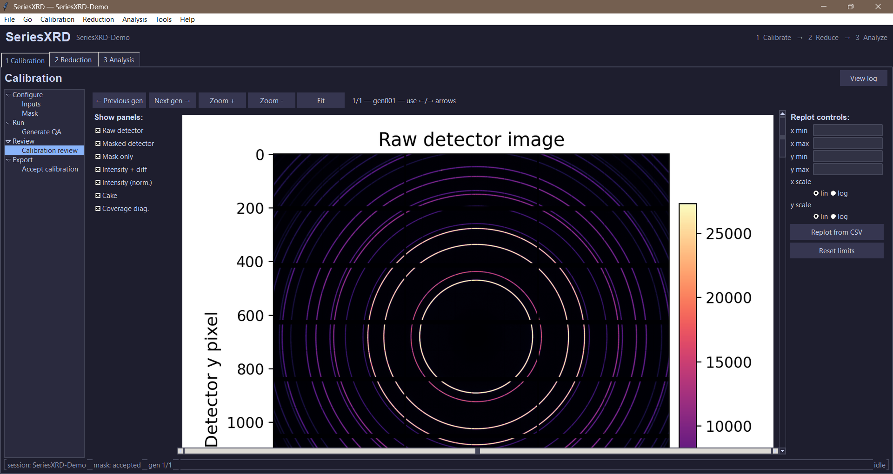
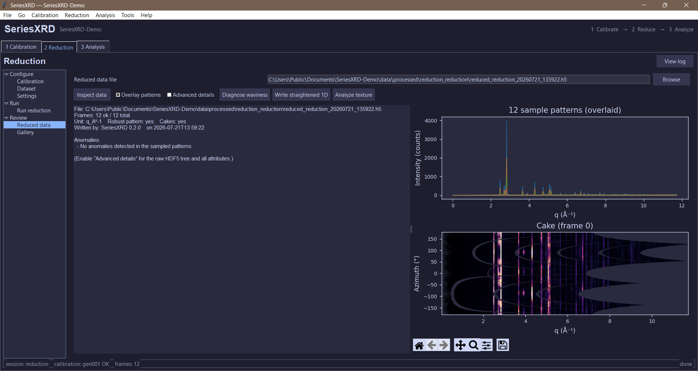
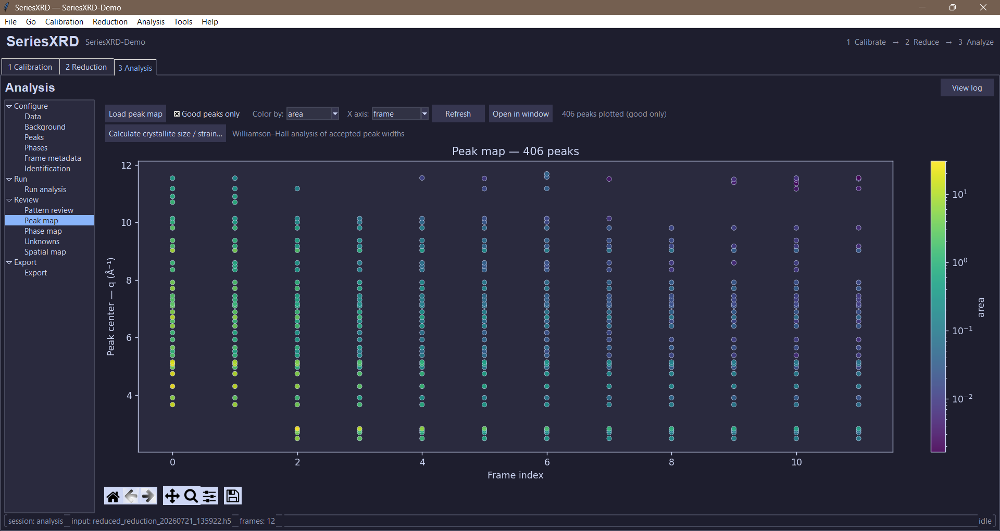
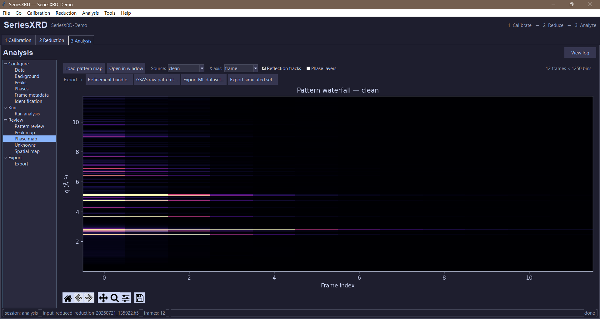

# Ti-6Al-4V end-to-end demo

This example provides a compact, real synchrotron dataset for exercising
SeriesXRD calibration and reduction. It contains 12 measurements of one
Ti-6Al-4V specimen acquired at exposure times from 1.0 to 0.004 seconds, plus
the matching CeO2 calibration frame.

The detector images are downloaded from Zenodo and are not committed to this
repository or included in the Python package. The repository contains only a
pinned source manifest, downloader, attribution, and a small derived PONI
geometry file. See [ATTRIBUTION.md](ATTRIBUTION.md) for the dataset citations,
license, and calibration provenance.

## Prepare the demo

From the repository root:

```bash
python examples/ti64_demo/fetch_demo_data.py
```

The script downloads approximately 48 MB of compressed source data, verifies
the MD5 checksums published by Zenodo, extracts only the 13 required CBF
files, renames them descriptively, and writes SHA-256 checksums. Re-running it
uses the verified local cache.

## Local structure

The generated `workspace/` directory is ignored by Git:

```text
workspace/
|-- .cache/                         downloaded Zenodo archives
|-- data/
|   `-- raw/
|       |-- calibration/
|       |   |-- CeO2_run103764_99p801keV_908mm.cbf
|       |   `-- Ti64_908mm_refined.poni
|       `-- sample/                 12 Ti-6Al-4V CBF frames
`-- metadata/
    |-- frames.csv                  run/exposure/source/checksum mapping
    |-- checksums.sha256
    `-- source/                     original YAML, manifest, attribution
```

SeriesXRD will create its configuration, accepted-calibration, processed-data,
figure, preview, and log folders alongside these inputs.

## Run through the GUI

Launch the unified application with the generated directory as its workspace:

```bash
seriesxrd --workspace examples/ti64_demo/workspace
```

On Windows, if the console script is not on `PATH`, use:

```powershell
python -m seriesxrd.app --workspace examples\ti64_demo\workspace
```

1. In **1 Calibration**, select
   `data/raw/calibration/CeO2_run103764_99p801keV_908mm.cbf` as the calibration
   image and `data/raw/calibration/Ti64_908mm_refined.poni` as the input PONI.
   Select `CeO2` as the calibrant. Generate the QA result, inspect the ring
   overlay and residuals, then accept the calibration.

   

   *Calibration Review of the CeO2 detector image and available QA views.*

2. In **2 Reduction**, select `data/raw/sample` as the data folder and `*.cbf`
   as the pattern. The 12 frames should be detected. For a useful first run,
   use a q-axis, 1,500 bins, and enable robust and sigma-clipped channels.
   Saving cakes is optional but useful for the texture view. Run the reduction.

   

   *Reduction Review for all 12 exposure-series frames.*

3. In **3 Analysis**, confirm the handed-off reduced HDF5 file. Run background
   separation and peak fitting first. Phase identification needs appropriate
   alpha-Ti and beta-Ti reference CIFs; these are deliberately not fabricated
   or redistributed by this demo.

   

   *Analysis Pattern Review for the one-second exposure.*

   

   *Fitted peak centers across the exposure series; marker color represents
   fitted peak area.*

   

   *Clean-pattern waterfall across the complete exposure series.*

The exposure-time sequence is ideal for checking ingestion, calibration,
integration, background handling, peak stability, and low-count behavior. It
is not a pressure, temperature, or time-evolution experiment, so treat
exposure time as the series variable when interpreting plots.

## Metadata caution

The embedded CBF headers contain placeholder wavelength and detector-distance
values. Use the published source YAML and supplied PONI instead:

- Energy: 99.801 keV
- Wavelength: 0.12423 A (`1.2423e-11` m)
- Nominal sample-to-detector distance: 908 mm
- Detector: Pilatus 2M CdTe, 172 micrometre pixels
- Calibration standard: CeO2, run 103764
